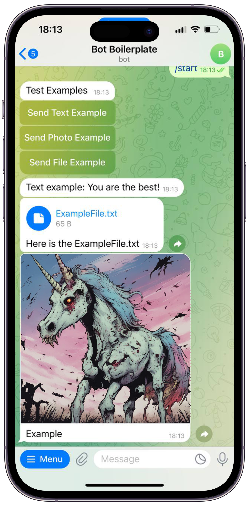

# Telegram Bot Boilerplate Project

This repository serves as a boilerplate for creating Telegram bots using .NET Core. It includes examples of how to send text messages, photos, and files. Additionally, it features a built-in HTTP request/response tracker to log all HTTP interactions made by the bot.

## Features

- **Sending Messages:**
  - Example of sending text messages to Telegram users.
  - Example of sending photos as responses.
  - Example of sending files such as documents or media.

- **HTTP Request/Response Tracker:**
  - Captures and logs all incoming and outgoing HTTP requests/responses.
  - Utilizes MongoDB or another database to store logs securely.

## Usage

### Prerequisites

- .NET Core SDK
- MongoDB (or another database supported by your chosen repository implementation)

### Getting Started

1. Clone this repository.
2. Configure your bot token and other settings in `appsettings.json`.
3. Build and run the application.